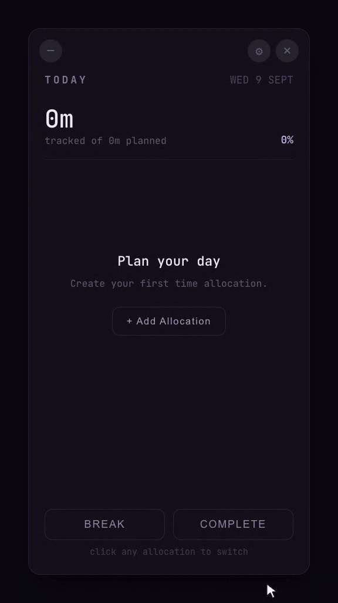

# Nebula

A floating, always-on-top macOS widget for planning and tracking daily time
allocation. See [PRD.md](PRD.md) for the product spec and
[docs/ROADMAP.md](docs/ROADMAP.md) for how it is being built.



**Status:** every phase on the [roadmap](docs/ROADMAP.md) is done — the app
plans a day, tracks it, notifies on milestones, and packages into a `.app` and
a `.dmg`.

## Requirements

- macOS
- [uv](https://docs.astral.sh/uv/) — `brew install uv`
- Node 24 LTS (pinned in `.nvmrc`) and pnpm

uv fetches its own Python (3.13, pinned in `.python-version`), so the system
Python is left alone. Node is not managed for you: run `nvm use` before any
`pnpm` command, since a shell that has not done so may resolve to a different
Node version.

## Run

Build the frontend once, then start the app:

```sh
cd frontend && pnpm install && pnpm build && cd ..
uv run nebula
```

The first run creates `.venv/` and installs dependencies from `uv.lock`. There
is no virtualenv to activate.

A fresh clone must run `pnpm build` before `uv run nebula` works — `dist/` is
generated, not committed.

## Develop

Two terminals:

```sh
# terminal 1
cd frontend && pnpm dev

# terminal 2
uv run nebula --dev
```

The window loads the Vite dev server, so edits to `frontend/src/` hot-reload
inside the native window. Node 24 is required (`nvm use` reads `.nvmrc`).

## Demo recording

`assets/demo.gif` — the recording at the top of this file — is generated, not
captured by hand:

```sh
node scripts/record-demo.mjs
```

It starts the dev server if one is not already running, plays a scripted fifteen
seconds against `frontend/demo.html`, and encodes the result with ffmpeg (which
must be on `PATH`). Playwright is not a dependency of the project: the script
installs it into `scripts/.demo-tools/` on first run and drives the Chrome
already on the machine.

The GIF is a true 576x1026 render — the 384x684 window at 1.5x — displayed at
288 wide, which is exactly 2x on a retina screen and not a pixel more. That
comes from zooming the page and enlarging the viewport together, which is the
only way it works: Playwright's video is the size of the viewport, and asking
`recordVideo.size` for a larger frame pads the difference grey rather than
scaling the page. Two recordings shipped three-quarters grey before that was
noticed, so the script now checks a corner of the finished GIF and fails if it
is padding rather than the app's near-black ground.

`--fps` and `--out` override the defaults.

`demo.html` is a second Vite entry that hands the real dashboard an in-memory
day (`frontend/src/demo/`) instead of the Python bridge, so the recording shows
the real components taking real clicks. It is dev-only — `vite build` takes
`index.html` as its single input, so nothing under `src/demo/` ships.

Two things it fakes deliberately: a time-lapse clock, so the hour that fills the
first allocation to 50% passes in a second and a fifth, and a drawn cursor,
because a headless page has none to film. The beat sheet and its timings are
`frontend/src/demo/script.ts`, which the recorder reads its length from;
`pnpm test` holds the beats inside that budget and stops them overlapping.

It plans four allocations because that is what the card holds: a row is 98px in
a 358px list, so three fill it and a fourth leaves the day looking busy. Two
left the widget looking mostly empty.

## Icon

`assets/icon.png` is the square source image; `assets/Nebula.icns` is the macOS
icon built from it with `sips` and `iconutil`.

`app.py` passes the `.icns` to `webview.start(icon=...)`, so the running app
shows its own icon rather than the generic Python document icon. It has to go
through pywebview: setting the icon directly before `webview.start()` is too
early for the Dock tile to pick it up. The Dock *name*
still reads `python3.13`: that comes from a bundle's `Info.plist`, which an
unbundled process does not have, and is fixed when the app is packaged as a
`.app` (PRD §26).

The window itself is frameless, so it has no title bar to show an icon in.
`frontend/public/favicon.png` is the same image, for the browser tab when
running `pnpm dev` outside the native window.

To regenerate the `.icns` after replacing `assets/icon.png`:

```sh
ICONSET=assets/Nebula.iconset
mkdir -p "$ICONSET"
while read -r size name; do
  sips -z "$size" "$size" assets/icon.png --out "$ICONSET/$name.png"
done <<'SIZES'
16 icon_16x16
32 icon_16x16@2x
32 icon_32x32
64 icon_32x32@2x
128 icon_128x128
256 icon_128x128@2x
256 icon_256x256
512 icon_256x256@2x
512 icon_512x512
1024 icon_512x512@2x
SIZES
iconutil -c icns "$ICONSET" -o assets/Nebula.icns
rm -rf "$ICONSET"
```

## Building a release

```sh
./scripts/build.sh
```

Produces `release/Nebula.app` and `release/Nebula-<version>.dmg`. The version
comes from `pyproject.toml` and is written into the app's `Info.plist`, so the
two cannot drift.

The app is unsigned, so the first launch needs the Gatekeeper override
described in `packaging/first-run.txt`, which ships inside the disk image.

## Tests and linting

```sh
uv run pytest                 # everything, including the GUI close-button test
uv run pytest -m "not gui"    # fast; skips the test that opens a window
cd frontend && pnpm lint      # oxlint
cd frontend && pnpm test      # vitest
```

A pre-commit hook runs oxlint (when `frontend/` is touched) and the non-GUI
tests. Hooks are not cloned, so enable it once per checkout:

```sh
git config core.hooksPath .githooks
```

It skips the GUI test deliberately: that test opens a real always-on-top
window, which would steal focus on every commit. Run the full suite before
merging.

## Layout

```
frontend/         React + TypeScript UI, built by Vite
└── src/
    ├── components/   the dashboard's pieces
    ├── demo/         the README recording's scripted day (dev-only)
    ├── bridge.ts     typed wrappers over window.pywebview.api
    ├── format.ts     duration and date formatting
    ├── tick.ts       advancing the Active allocation between refetches
    ├── targets.ts    daily targets: seconds, hh/mm, and the planned total
    └── milestones.ts when to ask Python about a 95% or 100% crossing
dist/             build output (generated, gitignored)
src/nebula/
├── __main__.py   entry point
└── app.py        window shell + JS/Python bridge
```

The window is frameless, transparent and always-on-top (PRD §27), so the card's
rounded corners and shadow are drawn in CSS. Because there are no traffic
lights, the UI provides its own close button, which calls Python through
`window.pywebview.api`. Drag the card anywhere to move it.
